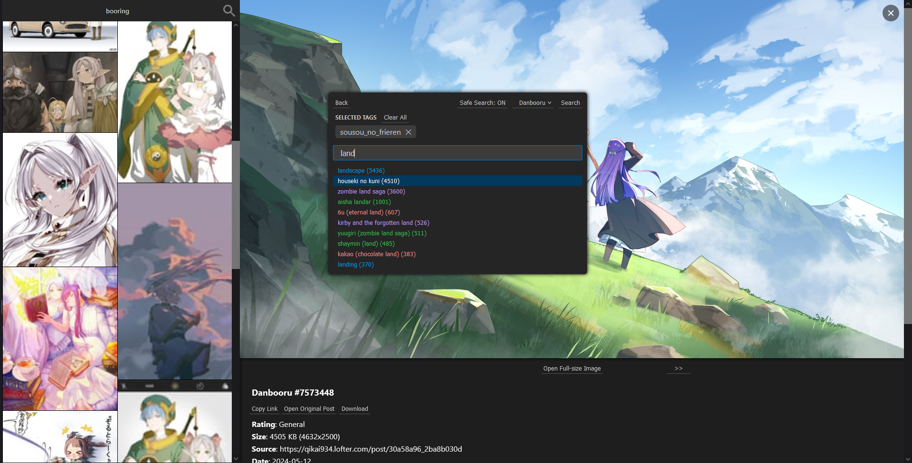
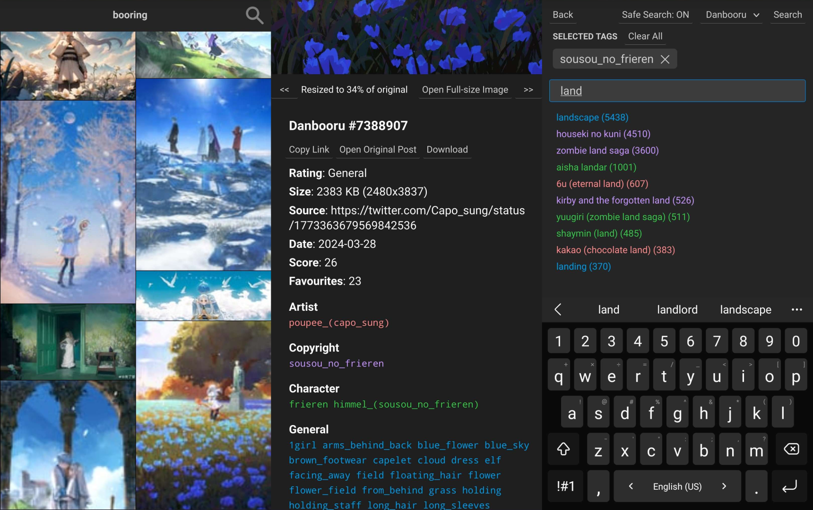

# Booring

Booring is a lightning fast, feature-rich, mobile optimised web client for a multitude of image boards (called "boorus") with support for a wide range of different sites and APIs, as well as tools to easily extend support to new sites.

## Features 
- More pleasant, practical, and user-friendly UI than other clients and the original sites
- First-class desktop and mobile support
- **Search and autocomplete for every site**
- Highly performant and lightweight, to save battery life on mobile
- Safe search option to filter out any NSFW content
- Gets around Danbooru's tag limit, allowing you to search as many tags as you want without buying premium
- Highly flexible API to extend support to as many sites as possible, including sites with very unconventional APIs
- Support for sites that use both realtime autocomplete, cache-based autocomplete, or no autocomplete at all
- "Site Builder" templating class to easily extend support to other standard Booru-like sites
The primary purpose of Booring is to act as an alternative, better front-end for common boorus, and nothing more. As such, it only contains the bare minimum features you'd see on typical boorus, like searching and autocomplete. Things like favourites, settings, etc. have been purposely left out.

## Sites Supported
- Danbooru
- Gelbooru
- Yande.re
- Safebooru
- Konachan
- Zerochan
- Rule 34

## Disclaimer
This tool is for personal use only, please refrain from hosting it on public servers. By using or installing this tool, you agree to not use to cause harm, whether intentionally or accidentally. **Please do not spam requests to sites.** If a site recieves too much spam, they might consider adding spam protection, which will make it impossible for this tool to access them.

## Installation
1. `git clone https://github.com/markpwns1/booring`
2. `npm install`
3. `npm run build:server`
4. `npm run build:client`
5. `npm start`
6. The website will then be running at `localhost:3000`.

## Contributing
Feel free to open a pull request if you'd like to add support for another site. Search, post viewing, and autocomplete functionality are the bare minimum standards I like to keep when adding sites to Booring.