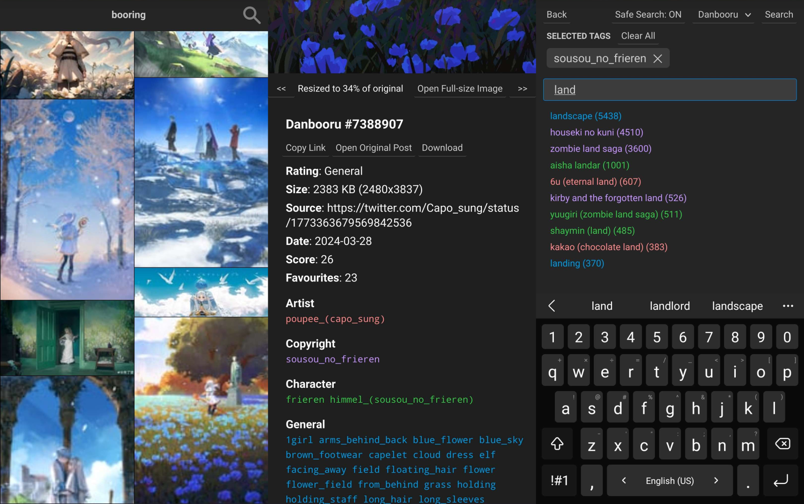

# Booring

Booring is a lightning fast, feature-rich, mobile optimised web client for a multitude of image boards (called "boorus") with support for a wide range of different sites and APIs, as well as tools to easily extend support to new sites.


(Mobile interface shown below)


## Features 
- More pleasant, practical, and user-friendly UI than other clients and the original sites
- First-class desktop and mobile support
- **Search and autocomplete for every site**
- Highly performant and lightweight, to save battery life on mobile
- Safe search option to filter out any NSFW content
- Gets around Danbooru's tag limit, allowing you to search as many tags as you want without buying premium
- Highly flexible API to extend support to as many sites as possible, including sites with very unconventional APIs
- Support for sites that use both realtime autocomplete, cache-based autocomplete, or no autocomplete at all
- "Site Builder" templating class to easily extend support to other standard Booru-like sites

The primary purpose of Booring is to act as an alternative, better front-end for common boorus, and nothing more. As such, it only contains the bare minimum features you'd see on typical boorus, like searching and autocomplete. Things like favourites, settings, etc. have been purposely left out.

## Sites Supported
- Danbooru
- Gelbooru
- Yande.re
- Safebooru
- Konachan
- Zerochan
- Rule 34

## Disclaimer
This tool is for personal use only, please refrain from hosting it on public servers. By using or installing this tool, you agree to not use to cause harm, whether intentionally or accidentally. **Please do not spam requests to sites.** If a site recieves too much spam, they might consider adding spam protection, which will make it impossible for this tool to access them.

## Installation
1. `git clone https://github.com/markpwns1/booring`
2. `npm install`
3. `npm run build:server`
4. `npm run build:client`
5. `npm start`
6. The website will then be running at `localhost:3000`.

## Extending Support to Other Sites

There is a detailed API reference in `doc/index.html` if you need more info. And don't be afraid to inspect the source code, either!

To add support for a new site, create a file in `src/core/sites` and create a class inheriting `Site`.
```ts
export default class MySite extends Site {

    public override autocompleteEnabled = false;

    // If true, this site will be hidden in the site list when safe search is enabled
    public override isPorn = false;

    private searchInProgress: JQuery.jqXHR | null = null;

    public constructor() {
        // Name, ID. These can be anything, as long as they're unique
        super("My Site", "mysite");
    }

    // Search function to override to provide search functionality
    public override search(
        tags: string[], 
        page: number, 
        safeSearch: boolean, 
        send: (posts: Post[]) => void, 
        complete: (newPage: number, endOfResults: boolean) => void, 
        error: (error: any) => void
    ) { 
        searchInProgress = $.getJSON(`https://mysite.com/search?tags=${tags}&p=${page}`, (json: any[]) => {
            const posts = json.map(x => this.parsePost(x)); // Convert the list of JSON objects into a list of Posts
            send(posts); // Send the posts to the frontend (can be called multiple times)
            complete(page + 1, false); // Signal that the search is complete
        })
        .fail(error);
    }

    // Converts a JSON object with post information into a Booring Post object
    public override parsePost(json: any): Post {
        const post = new Post(this);
        post.id = json.id.toString();

        // A list of image URLs to display in the frontend, in order of smallest to largest
        post.imageResolutions = [ json.thumbnail, json.large_image, json.full_size_image ];

        post.fullWidth = json.full_size_image_width;
        post.fullHeight = json.full_size_image_height;

        post.originalPost = `https://mysite.com/posts/${json.id}`;

        // Anything you want can go in this table and it'll be displayed in the frontend
        post.properties = {
            "Rating": json.nsfw? "18+" : "E for Everyone",
            "Size": `${Math.round(json.file_size / 1000)} KB (${json.full_size_image_width}x${json.full_size_image_height})`,
            "Source": json.source,
            "Date": json.created_at,
            "Score": json.score.toString(),
            "Favourites": json.favourite_count.toString()
        };

        // Any category you want can go here, as long as its value is a string[]
        post.tagTypes = {
            "Artist": json.tags.artists,
            "Character": json.tags.characters,
            "General": json.tags.general,
        }

        post.requiresVideoPlayer = json.full_size_image.endsWith(".mp4")

        return post;
    }
    
    // Abort any searches in progress
    public abortSearch() { 
        this.searchInProgress?.abort();
    }
}
```

Then, to register the site, go inside `site-registry.ts` and add your site to the function.
```ts
import Site from "./site";
import Danbooru from "./sites/danbooru";
import Gelbooru from "./sites/gelbooru";
// ...
import MySite from "./sites/mysite";

export default function registerAll() {
    Site.register(new Danbooru());
    Site.register(Gelbooru);
    // ...

    Site.register(MySite);
}
```

### Proxies
Sometimes, a GET request to a site won't return anything unless you have the right headers, or sometimes a site will disallow cross-domain requests. Booring has a built-in proxy to get around these cases. See the example below:

```ts
export default class MySite extends Site {

    // Override the field `Site.proxyHeaders` with the headers you want to include
    public proxyHeaders: { [key: string]: string } = {
        "Referrer": "https://mysite.com/",
        "User-Agent": "curl 1.20.3",
        // ...
    }

    // Then, in the search function, use the proxify(this.id, url) function to route
    // the URL through a proxy
    public override search(...) { 
        const proxyURL = proxify("mysite" /* or use `this.id` */, `https://mysite.com/search?tags=${tags}&p=${page}`);
        searchInProgress = $.getJSON(proxyURL, (json: any[]) => {
            // ...
        })
        .fail(error);
    }
}
```

There are some variants too. 
- `proxify("generic", url)` will route the URl through a proxy without including any headers. This is just to get around cross-domain request restrictions.
- `proxify("json", url)` is the same as `proxify("generic", url)` but automatically parses the result into a JSON object.

### Site Builder
A lot of boorus use the same template, and have more or less the same API. That's why I also created a "Site Builder" class which helps reduce the boilerplate required to add support for a standard booru site. See the example below:

```ts
const TAG_TYPES = {
    0: TagType.General,
    1: TagType.Artist,
    // ...
}

function parseAutocompleteTag(json: any): AutocompleteTag {
    return {
        label: json.label,
        value: json.value,
        type: TAG_TYPES[json.type] || TagType.General
    } as AutocompleteTag;
}

function parsePost(json: any): Post {
    // ...
}

const MySite = SiteBuilder.buildSite({
    name: "My Site",
    id: "mysite",
    isPorn: false,

    proxyHeaders: {
        "Referrer": "https://mysite.com/"
    },

    searchUrl: proxify("generic", "https://mysite.com/search?tags={tags}&p={page}"),
    searchPageOffset: 1,
    searchTagDelimiter: ",",
    searchTransformer: parsePost,

    autocompleteModule: {
        url: proxify("generic", "https://mysite.com/autocomplete?q={tag}"),
        transformer: parseAutocompleteTag
    }
});

export default MySite;
```


## Contributing
Feel free to open a pull request if you'd like to add support for another site. Search, post viewing, and autocomplete functionality are the bare minimum standards I like to keep when adding sites to Booring.